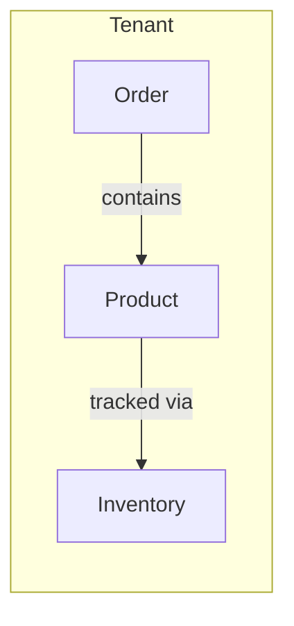

# **Interview Assignment - INVENTORY MANAGEMENT SYSTEM**

## **MODULE INTENT (Anchor for Candidate)**

The **INVENTORY Management System** provides a foundational, multi-tenant inventory management system. It allows users to manage Tenants, Products, Inventory levels, and Orders within a defined organizational scope. 
The objective of this assessment is to evaluate the candidate's **full-stack capabilities**, "vibe coding" speed, and ability to lay down a solid **architectural/pattern flow** (UI + Backend API + Database) for a multi-tenant application.

**Preferred Tech Stack:**
- **Frontend UI:** React.js (Tailwind CSS and Redux)
- **Backend API:** Node.js / Express
- **Database:** Any RDBMS (e.g., PostgreSQL, MySQL)

*You can also develop using your expertise tech stack as well. Upon completion, please share your developed solution by providing a link to a public GitHub repository.*

**NOTE: If you encounter any gaps or ambiguities in these requirements, please define your own assumptions and proceed with development. You will have the opportunity to discuss and highlight these assumptions during the interview.**

**Additionally, feel free to bring your own creativity and innovation to this application! The provided wireframes are only for reference, you are welcome to design a different UI and flow if you believe it provides a better user experience.**

---

## **Technical Deliverables & Evaluation Criteria**

### **Expected Deliverables**
1. **Database Schema**: Tables/Collections for `Tenant`, `Product`, `Inventory`, and `Order` demonstrating proper foreign key/reference relationships.
2. **Backend API**: RESTful or GraphQL endpoints supporting CRUD operations with multi-tenant data isolation.
3. **Frontend UI**: Responsive pages matching the structural requirements outlined below.
4. **Architectural Flow**: Clean separation of concerns (Routes -> Controllers -> Services -> Repositories).

### **Evaluation Criteria**
- **Multi-Tenancy Handling**: How well is data scoped per tenant? (Are requests properly passing tenant IDs? Is data leaking across tenants?).
- **Vibe Coding & Speed**: Use of modern tools and AI assistance to quickly scaffold standard list/detail/form views.
- **Data Integrity**: Enforcing rules like "Orders can only map to Active products" and "Insufficient inventory puts orders into a Pending state".
- **Code Quality**: Reusable components, consistent API responses, and clean error handling.

 
## **Global UI Requirements**

To maintain a consistent experience, all modules must adhere to the following layout constraints:

1. **Left Navigation**: A fixed sidebar containing links for `Tenant`, `Product`, `Inventory`, and `Order`.
2. **Top Header**: A clean header section.
   - **Left**: Application Logo/Name.
   - **Right**: User Icon/Avatar.
   - *Note: Remove the global top search bar from all pages.*
3. **Tenant Scope**: 
   - Every List page (Product, Inventory, Order) **must** include a **Tenant Dropdown** at the top right of the page content.
   - Changing the dropdown must reload the table to show data *only* for the selected tenant.
   - *Reference: [Tenant List Wireframe](./wireframes/tenant_list.html)*

---

## **Entity Mapping Flow**

---
## **1. Tenant Module**

### **User Intent**
*As a system administrator, I want to manage different organizational tenants so that data can be segregated appropriately.*

### User Story 1.1 - Tenant List
**As an** Admin  
**I want** to see a list of all tenants  
**So that** I can monitor active accounts  

**Acceptance Criteria:**
- **Given** tenants exist in the database
- **When** I navigate to the Tenant List page
- **Then** a table is displayed with columns: `Tenant Name`, `Tenant ID`, `Status (Active)`.
- **And** pagination and basic text search are supported.

### User Story 1.2 - Create Tenant
**As an** Admin  
**I want** to create a new tenant  
**So that** a new organization can use the system  

**Acceptance Criteria:**
- **Given** I click "Create Tenant"
- **When** I fill out the form with a `Tenant Name *` (required) and submit
- **Then** the system checks if the Tenant Name already exists.
- **If** it exists, an inline error is shown.
- **If** valid, the tenant is created and I am redirected to the Tenant List.

---

## **2. Product Module**

### **User Intent**
*As a user, I want to define the catalog of items our tenant sells or tracks.*

### User Story 2.1 - Product List
**As a** User  
**I want** to view products specific to my selected tenant  
**So that** I can browse our catalog  

**Acceptance Criteria:**
- **Given** I have selected a Tenant from the dropdown
- **Then** the table displays products belonging *only* to that tenant.
- **And** columns include `Name`, `SKU`, `Category`, `Status (Active/Inactive)`.
- **And** the list supports Search, Pagination, and Sorting.
- **And** there is *no* Import/Export functionality.
- **And** each row has an Action Menu (⋮) with `View`, `Edit`, and `Delete` options.
   - *Reference: [Product List Wireframe](./wireframes/product_list.html)*

### User Story 2.2 - Product Details & Management
**As a** User  
**I want** to view, edit, or delete a product  
**So that** I can keep catalog data accurate  

**Acceptance Criteria:**
- **When** I click "View" from the action menu, **Then** I see the Product Details page.
- **And** the details page has an `Edit` icon and a `Delete` icon.
- *Reference Details: [Detail View Wireframe](./wireframes/detail_view.html)*
- **When** I click "Edit", **Then** I am taken to the Edit Product form.
- *Reference Form: [Product Edit Wireframe](./wireframes/product_edit.html)*
- **And** the form must have the following required fields marked with an asterisk (*): `SKU *`, `Product Name *`, `Category *`, `Reorder Threshold *` (The INVENTORY level at which a new purchase should be triggered), and `Cost per Unit *`.
- **And** I can toggle the Product Status between `Active` and `Inactive` (optional, no validation needed).

---

## **3. Inventory Module**

### **User Intent**
*As a user, I want to manage the INVENTORY levels of my products so we know what is available to fulfill orders.*

### User Story 3.1 - Inventory List
**As a** User  
**I want** to see current INVENTORY levels for all products in my tenant  

**Acceptance Criteria:**
- **Given** I am on the Inventory List with a tenant selected
- **Then** a table displays `Product Name`, `SKU`, `Cost per Unit`, `Current INVENTORY`, and `Reorder Threshold`.
- **And** the row Action Menu (⋮) contains `View`, `Edit`, and `Delete`.

### User Story 3.2 - Inventory Details & Updates
**As a** User  
**I want** to view detailed inventory data and quickly update INVENTORY values  

**Acceptance Criteria:**
- **When** I view Inventory Details, **Then** I see product information, `Cost per Unit`, and current INVENTORY numbers.
- **And** there is an input field `Current INVENTORY *` (required field marked with asterisk) and button to directly update the inventory value.
- **And** clicking on the Product Name text acts as a hyperlink, taking me to the Product Details page.

---

## **4. Order Module**

### **User Intent**
*As a user, I want to create and track orders placed against our product inventory.*

### User Story 4.1 - Order List
**As a** User  
**I want** to see a list of orders for my tenant  

**Acceptance Criteria:**
- **Given** a tenant is selected
- **Then** the table displays `Order ID`, `Product`, `Quantity`, `Status`, and `Date`.
- **And** the row Action Menu (⋮) contains `View`, `Edit`, and `Delete`.

### User Story 4.2 - Create Order & Inventory Validation
**As a** User  
**I want** to create a new order and ensure INVENTORY is available  

**Acceptance Criteria:**
- **Given** I am creating a new order
- **When** I open the product selection dropdown `Select Product *` (required field marked with asterisk)
- **Then** I *only* see products that have a status of `Active`. (Inactive products cannot be ordered).
- **When** I submit the order with a `Requested Quantity *` (required field marked with asterisk)
- **Then** the system checks current inventory levels.
- **If** `Inventory >= Requested Quantity`, the order is saved with status `Created`.
- **If** `Inventory < Requested Quantity`, the order is saved with status `Pending`.

### User Story 4.3 - Order Details
**As a** User  
**I want** to view order details and process confirmations  

**Acceptance Criteria:**
- **When** I view Order Details, **Then** I see product info, requested quantity, and current inventory data.
- **And** there are primary buttons for `Confirm` and `Cancel`.
- **And** clicking on the associated product takes me to the Product Details page.

---
*Note: Please reference the provided HTML files in the `wireframes/` directory to guide UI development and layout structures.*

